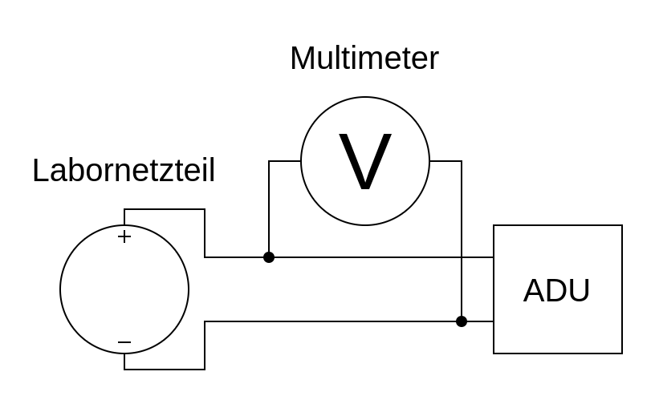

# Analog Digital Converter Test Arduino Uno

This repository only contains a script to measure the ADC input of an Arduino Uno / Nano.

## Circuit Diagram

## Scripts

    - Uno.cpp for 0 to 5 Volts

    - Uno_55V.cpp for 0 to 55 Volts with voltage divider (100k & 10k Ohm)

## Results

The plotted results can be found [here](https://github.com/PaulusElektrus/MA-Plots/tree/main/ADC).